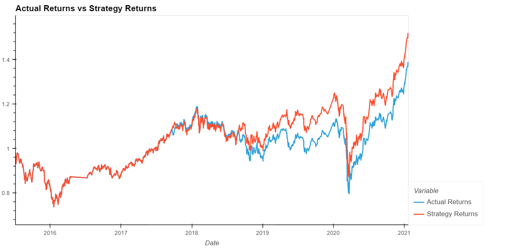
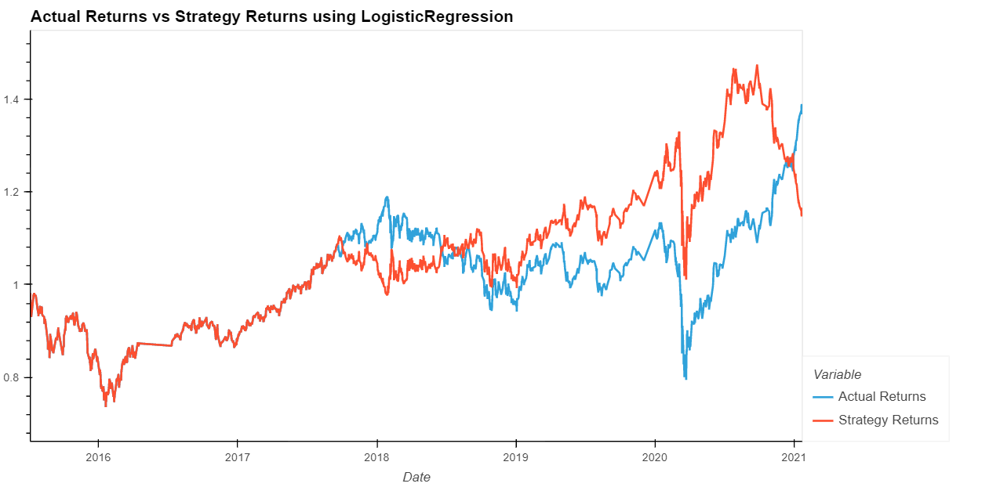

# Machine Learning Trading Bot

## Overview

In this Challenge, I assumed the role of a financial advisor to improve the existing algorithmic trading systems by enhancing the existing trading signals with machine learning algorithms that can adapt to new data. I created an algorithmic trading bot that learns and adapts to new data and evolving markets.

In Jupyter notebook I implemented an algorithmic trading strategy that uses machine learning to automate the trade decisions. I then adjusted the input parameters to optimise the trading algorithm and trained a new machine learning model and compared its performance to that of a baseline model.

### Establish a Baseline Performance

The baseline model performs well with the current parameters. 

### Evaluate a New Machine Learning Classifier

I used SciKit Learn LogisticRegression model to create a new machine learning classifier. This model appears to outperform the baseline model.

